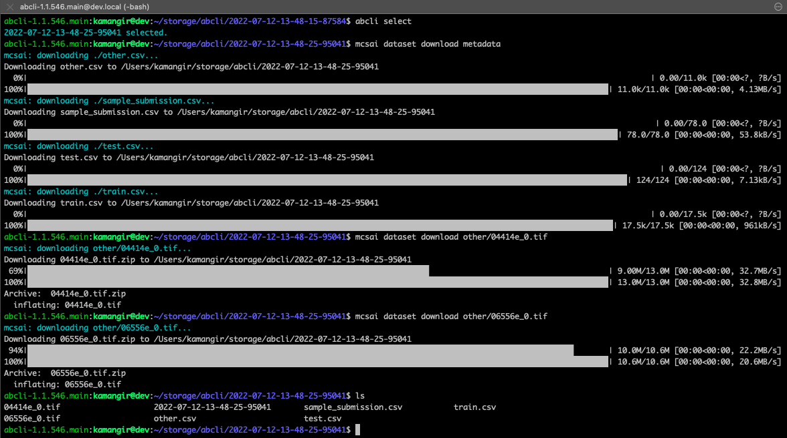

# Mayo Clinic - STRIP AI (mcsai)

`mcsai` is a bash cli for the [Image Classification of Stroke Blood Clot Origin kaggle competition](https://www.kaggle.com/competitions/mayo-clinic-strip-ai/overview) based on [abcli](https://github.com/kamangir/awesome-bash-cli) - to see list of `mcsai` commands type in:

```
mcsai help
```
```
mcsai dataset download filename_1
 . download filename_1 from mcsai dataset.
mcsai dataset list [count=10]
 . list [first 10 files in] mcsai dataset.
mcsai install
 . install mcsai.
mcsai validate
 . validate mcsai.
```

## example 1

purpose: download a few files from the dataset and access them in [OpenSlide](https://openslide.org/api/python/) - based on [this notebook](https://www.kaggle.com/code/naotous/openslide-how-to-open-whole-slide-images?scriptVersionId=100210828).

first install and validate `mcsai`:

```
mcsai install
mcsai validate
```

you should see `openslide-1.2.0` or higher.

now review the names of the first 10 files in the dataset:

```
mcsai dataset list count=10
```

then download a few of them:

```
abcli select
mcsai dataset download validate
mcsai dataset download other/04414e_0.tif
mcsai dataset download other/06556e_0.tif
mcsai notebook browse
```



[openslide.ipynb](openslide.ipynb) should be up and running. 🚀

/END